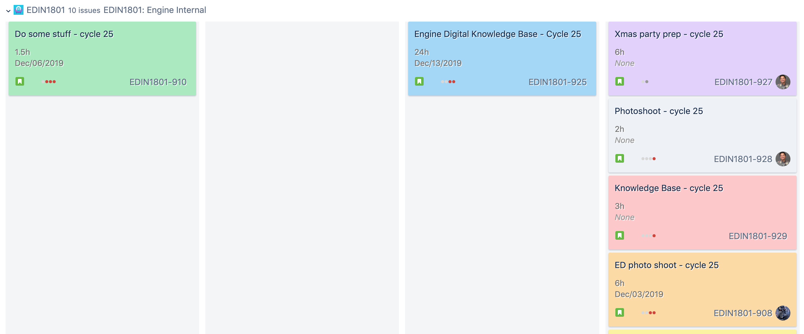

Rainbow JIRA
===============

> Colorize the cards on your JIRA board

### Installation

[Install from the Chrome Web Store](https://chrome.google.com/webstore/detail/rainbow-jira/alecogdpnecfnmfbhhfibjjmmboendhl)

### Development

1. Clone the project
2. Open [chrome://extensions/](chrome://extensions/)
3. Click "Load unpacked"
4. Navigate to the root of the cloned folder
5. Click "Select"
6. Work away!
